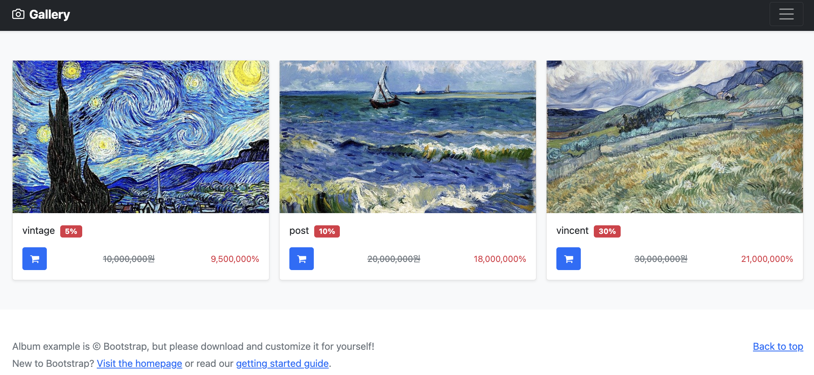
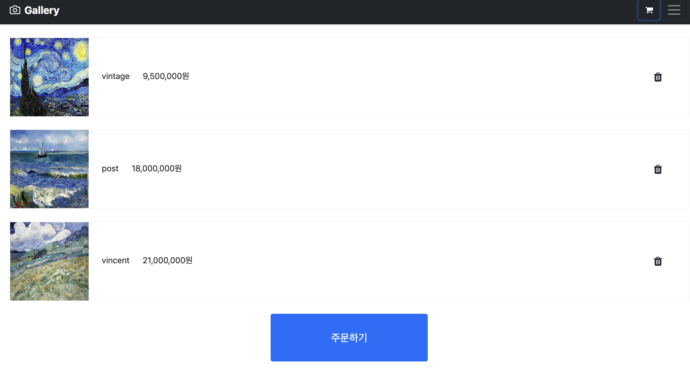
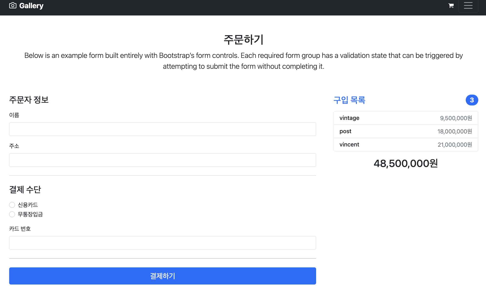

# 프로젝트명: 그림 작품 쇼핑몰 (gallery-shopping-center)
> 웹사이트의 목적은 화가 작품 쇼핑몰입니다. 작품을 선택하고 장바구니에 담고 새로 생성된 주문을 저장하기 위한 DB로 MariaDB를 사용하고, 백엔드는 Spring Boot 프런트엔드로 Vue.js를 사용했습니다.

앱에서 작품을 보고, 장바구니에 항목을 추가하고, 주문을 입력할 수 있습니다.




## 설치 방법

OS X & 리눅스:

```sh
npm install meal-order --save
```

윈도우:

```sh
edit autoexec.bat
```

## 사용 예제



주문버튼 클릭할 때 결제정보 입력
